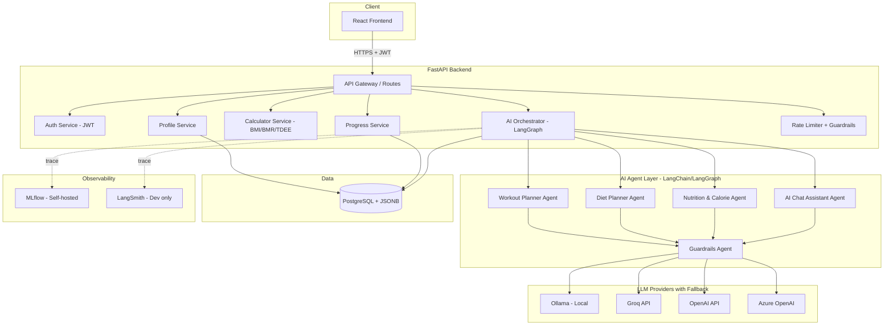
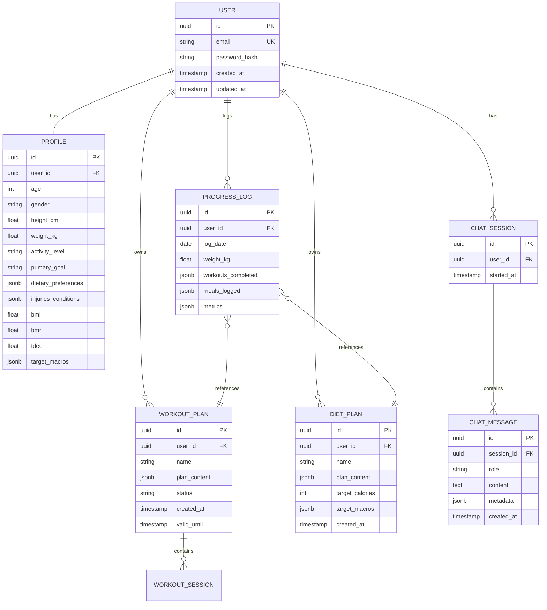
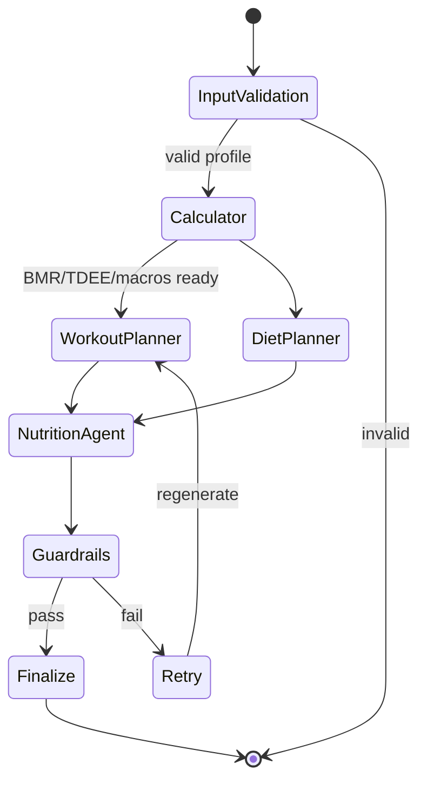

# Fitness Assistant — High-Level Design (HLD)

**Version:** 1.0
**Date:** 2026-09-04
**Status:** Draft
**Owner:** Fitness Assistant Team

---

## 1. Executive Summary

The **Fitness Assistant** is an AI-assisted web application that generates personalized workout and diet plans for users based on their demographic, physiological, and lifestyle data. It combines deterministic health calculations (BMI, BMR, TDEE, macros) with a **multi-agent LLM system** to produce explainable, safe, and adaptive fitness recommendations.

The system is designed to be:
- **Personalized** — plans tailored to each user's profile, goals, and constraints.
- **Explainable** — each recommendation includes the reasoning behind it.
- **Safe** — guardrails prevent unsafe advice (e.g., extreme calorie deficits, injury-aggravating exercises).
- **Cost-efficient** — leverages free-tier hosting and multi-provider LLM fallback (Ollama local + Groq/OpenAI/Azure cloud).
- **Observable** — full experiment tracking via MLflow and LangSmith.

---

## 2. Business Requirements

### 2.1 Problem Statement
Generic fitness apps offer static, one-size-fits-all plans. Users struggle to get personalized guidance without hiring an expensive personal trainer or nutritionist. An AI-driven assistant can democratize access to individualized fitness planning.

### 2.2 Business Goals
| # | Goal | Success Metric |
|---|---|---|
| BG-1 | Deliver personalized workout plans | ≥ 80% user satisfaction on plan relevance |
| BG-2 | Deliver personalized diet plans respecting dietary preferences | 100% adherence to declared restrictions (vegan, allergies, etc.) |
| BG-3 | Track user progress over time and adapt plans | Weekly plan adjustment based on logged progress |
| BG-4 | Keep infrastructure cost near zero during MVP | Deploy fully on free tiers |
| BG-5 | Provide explainable AI recommendations | Every plan includes rationale text |

### 2.3 Target Users
- **Primary:** Adults (18–60) seeking structured fitness guidance without a personal trainer.
- **Secondary:** Fitness enthusiasts wanting AI-powered plan adjustments based on progress.
- **Out of scope (MVP):** Users with clinical medical conditions requiring professional supervision (diabetes, heart disease, pregnancy).

### 2.4 Functional Requirements
| ID | Requirement |
|---|---|
| FR-1 | Users can register, log in, and manage their profile (age, gender, height, weight, activity level, goals, dietary preferences, injuries). |
| FR-2 | System calculates BMI, BMR, TDEE, and target macros from profile data. |
| FR-3 | System generates a personalized workout plan (split, exercises, sets, reps, progression). |
| FR-4 | System generates a personalized diet plan (daily calories, macros, meal suggestions). |
| FR-5 | Users can log daily progress (weight, workouts completed, meals). |
| FR-6 | System adapts plans based on logged progress (weekly review). |
| FR-7 | Users can chat with an AI assistant for questions (form checks, substitutions, motivation). |
| FR-8 | Guardrails block unsafe recommendations (extreme deficits, unsafe exercises given injuries). |

### 2.5 Non-Functional Requirements
| Category | Requirement |
|---|---|
| Performance | P95 API response < 2s for CRUD; < 15s for AI plan generation |
| Availability | 99% uptime (MVP), 99.9% (production) |
| Scalability | Support 10k concurrent users at production scale |
| Security | OWASP Top 10 compliance, encrypted data at rest and in transit |
| Privacy | GDPR-aligned data handling; user can export/delete their data |
| Observability | Full trace of every AI call (tokens, latency, cost) |
| Cost | MVP hosted entirely on free tiers |

---

## 3. System Architecture

### 3.1 High-Level Diagram



### 3.2 Component Responsibilities

| Component | Responsibility |
|---|---|
| **React Frontend** | User interface, forms, dashboards, chat UI |
| **FastAPI Backend** | REST API, request validation, auth, orchestration |
| **Auth Service** | JWT issuance, refresh tokens, password hashing (bcrypt/argon2) |
| **Profile Service** | CRUD operations for user profiles |
| **Calculator Service** | Deterministic BMI/BMR/TDEE/macro calculations (no LLM) |
| **AI Orchestrator** | LangGraph state machine coordinating multi-agent workflow |
| **Workout Planner Agent** | Generates workout split, exercises, sets/reps |
| **Diet Planner Agent** | Generates meal plans respecting preferences and macros |
| **Nutrition & Calorie Agent** | Calculates per-meal nutrition, ingredient breakdown |
| **AI Chat Assistant** | Handles free-form user questions with context |
| **Guardrails Agent** | Validates outputs against safety rules before returning |
| **Progress Service** | Logs and analyzes user progress, triggers plan adaptation |
| **PostgreSQL + JSONB** | Structured data + flexible AI-generated content storage |
| **MLflow** | Production experiment tracking (tokens, latency, cost, evals) |
| **LangSmith** | Dev-time visual trace debugging |

---

## 4. Technology Stack

| Layer | Technology | Rationale |
|---|---|---|
| Frontend | React + TypeScript + Vite | Modern, type-safe, fast dev experience |
| UI Library | Tailwind CSS + shadcn/ui | Fast styling, accessible components |
| State Mgmt | React Query + Zustand | Server state + minimal client state |
| Backend | Python 3.11+ / FastAPI | Async, type-safe, auto OpenAPI docs |
| ORM | SQLAlchemy 2.0 (async) + Alembic | Industry standard, migrations |
| Database | PostgreSQL 16 + JSONB | Relational + document flexibility in one DB |
| AI Framework | LangChain + LangGraph | Multi-agent orchestration standard |
| LLM Providers | Ollama, Groq, OpenAI, Azure OpenAI | Fallback chain, cost optimization |
| Experiment Tracking | MLflow (self-hosted) + LangSmith (dev) | Free durable tracking + best-in-class dev UI |
| Auth | JWT (access + refresh) + bcrypt/argon2 | Stateless, secure, industry standard |
| Validation | Pydantic v2 | Type-safe schemas, auto-validation |
| Testing | pytest, pytest-asyncio, Jest, React Testing Library | Comprehensive test coverage |
| Linting | ruff, black, mypy, ESLint, Prettier | Code quality enforcement |
| CI/CD | GitHub Actions | Free for reasonable usage |
| Containerization | Docker + docker-compose | Consistent environments |
| Frontend Hosting | Vercel / Netlify (free tier) | Zero-config React deployment |
| Backend Hosting | Render / Railway / Azure App Service (free tier) | Free FastAPI hosting |
| DB Hosting | Supabase / Neon.tech (free tier) | Managed Postgres with JSONB |
| Error Tracking | Sentry (free tier) | Production error monitoring |

---

## 5. Data Model

### 5.1 Core Entities (Relational)



### 5.2 JSONB Usage Rationale
- `plan_content` — AI-generated plan structure varies per user/goal; JSONB gives schema flexibility while staying in Postgres.
- `dietary_preferences`, `injuries_conditions` — variable-length lists with optional structured details.
- `target_macros` — small object (protein/carbs/fat grams), naturally document-shaped.

---

## 6. AI Multi-Agent Design

### 6.1 Agent Workflow (LangGraph)



### 6.2 Agent Details

| Agent | Input | Output | Model Tier |
|---|---|---|---|
| Workout Planner | Profile, goal, TDEE, injuries | Structured workout JSON (split, exercises, sets, reps, progression) | Strong (GPT-4-class or Groq Llama-70B) |
| Diet Planner | Profile, dietary prefs, target macros | Structured meal plan JSON (breakfast/lunch/dinner/snacks) | Strong |
| Nutrition & Calorie Agent | Meal descriptions | Per-meal calories/macros breakdown | Cheap/fast (Groq Llama-8B, Ollama local) |
| AI Chat Assistant | User query + context (profile + current plans) | Conversational response | Medium (Groq Llama-70B) |
| Guardrails | Any agent output | Pass/fail + reason | Fast + rule-based checks |

### 6.3 LLM Provider Fallback Chain
```
Primary:   Groq (fast + free tier)
Fallback1: OpenAI / Azure OpenAI (reliability)
Fallback2: Ollama (local, offline capable)
```

### 6.4 Prompt Engineering Principles
- **Structured output** via Pydantic schemas + LangChain output parsers — no free-form JSON parsing.
- **Prompt versioning** — prompts stored as versioned templates, tracked in MLflow/LangSmith.
- **Minimal PII** — send derived data (age range, BMI, goal) instead of raw identifiers.
- **System prompts** enforce safety, tone, and output format.

---

## 7. Security Design

### 7.1 Threat Model (OWASP Top 10 Coverage)

| Risk | Mitigation |
|---|---|
| A01 Broken Access Control | JWT with per-user resource authorization; row-level checks on every query |
| A02 Cryptographic Failures | TLS everywhere; bcrypt/argon2 for passwords; secrets in env vars / vault |
| A03 Injection | Pydantic validation on all inputs; SQLAlchemy parameterized queries |
| A04 Insecure Design | Threat modeling done during design phase; guardrails on AI outputs |
| A05 Security Misconfiguration | Strict CORS; secure headers; no debug mode in prod |
| A06 Vulnerable Components | Dependabot; `pip-audit`; `npm audit` in CI |
| A07 Auth Failures | Short-lived access tokens; refresh token rotation; rate limiting on login |
| A08 Data Integrity Failures | Signed JWTs; input schema validation |
| A09 Logging Failures | Structured logs; centralized error tracking (Sentry) |
| A10 SSRF | LLM provider URLs whitelisted; no user-controlled URLs in server calls |

### 7.2 AI-Specific Security
- **Prompt injection defense**: strip/escape user input, apply system prompt priority, output validation.
- **Cost abuse prevention**: per-user token budget, rate limiting on AI endpoints.
- **Output guardrails**: validate JSON schema, block unsafe advice patterns.

### 7.3 Data Privacy
- Health data encrypted at rest (Postgres-level encryption).
- User can export all their data (GDPR Article 20).
- User can delete their account and all associated data (GDPR Article 17).
- Minimal PII sent to LLM providers; audit log of all external LLM calls.

---

## 8. Observability

### 8.1 Logging
- Structured JSON logs (`structlog`).
- Correlation IDs propagated across requests and agent calls.
- Log levels: DEBUG (dev), INFO (prod default), WARNING/ERROR (alerts).

### 8.2 Metrics (via MLflow + Prometheus-compatible endpoints)
- API: request rate, latency P50/P95/P99, error rate.
- AI: tokens per call, cost per call, latency per agent, guardrail pass/fail rate.
- Business: plans generated per day, active users, retention.

### 8.3 Tracing
- **MLflow autolog** for LangChain/LangGraph — captures every agent trace in production.
- **LangSmith** for dev-time visual debugging.
- End-to-end request tracing via OpenTelemetry (optional, later phase).

### 8.4 Alerting
- Sentry for error tracking.
- Alerts on: error rate spike, LLM cost threshold, guardrail failure rate spike.

---

## 9. Deployment & Infrastructure

### 9.1 MVP Deployment (Free Tier)
| Component | Host | Cost |
|---|---|---|
| Frontend | Vercel | Free |
| Backend | Render / Railway | Free (with cold starts) |
| Database | Supabase / Neon.tech | Free (500MB) |
| MLflow | Self-hosted on backend instance | Free |
| Sentry | Sentry.io | Free (5k events/month) |
| LangSmith | LangSmith.com | Free (~5k traces/month) |

### 9.2 Production Deployment (Future)
- Kubernetes on Azure/AWS with autoscaling.
- Managed PostgreSQL with read replicas.
- Dedicated MLflow tracking server with S3-backed artifact store.

### 9.3 CI/CD Pipeline
```
Push to branch → Lint → Type-check → Unit tests → Integration tests →
Build Docker image → Deploy to dev/staging → Smoke tests → Manual approval → Deploy to prod
```

---

## 10. API Design (High-Level)

### 10.1 Key Endpoints
| Method | Endpoint | Purpose |
|---|---|---|
| POST | `/auth/register` | Create user account |
| POST | `/auth/login` | Issue JWT tokens |
| POST | `/auth/refresh` | Refresh access token |
| GET/PUT | `/profile` | Get / update user profile |
| POST | `/plans/generate` | Trigger multi-agent plan generation |
| GET | `/plans/workout/latest` | Get current workout plan |
| GET | `/plans/diet/latest` | Get current diet plan |
| POST | `/progress` | Log daily progress entry |
| GET | `/progress/history` | Get progress over time |
| POST | `/chat/message` | Send message to AI assistant |
| GET | `/health` | Liveness probe |
| GET | `/ready` | Readiness probe |

All endpoints:
- Return JSON.
- Require JWT except `/auth/*`, `/health`, `/ready`.
- Validated via Pydantic schemas.
- Rate limited (stricter on AI endpoints).

---

## 11. Testing Strategy

| Test Type | Tools | Coverage Target |
|---|---|---|
| Unit (Backend) | pytest, pytest-asyncio | 80%+ on business logic |
| Unit (Frontend) | Jest, React Testing Library | 70%+ on components |
| Integration | pytest + testcontainers | Core API flows |
| AI Evaluation | LangSmith / MLflow eval datasets | Plan quality, guardrail effectiveness |
| End-to-End | Playwright | Critical user journeys |
| Load | Locust / k6 | Verify P95 targets |
| Security | OWASP ZAP, dependency scanning | Zero high/critical findings |

---

## 12. Roadmap

### Phase 1 — MVP (Foundation)
- Auth, profile management
- Deterministic calculators (BMI, BMR, TDEE, macros)
- Basic single-agent plan generation
- PostgreSQL setup with core schema
- Simple React UI

### Phase 2 — Multi-Agent AI
- LangGraph orchestration
- All four AI agents implemented
- Guardrails agent
- MLflow + LangSmith observability
- LLM provider fallback chain

### Phase 3 — Progress & Adaptation
- Progress logging
- Weekly plan adaptation based on progress
- AI chat assistant with context memory

### Phase 4 — Production Hardening
- Full test coverage
- Load testing
- Security audit
- Deployment automation

### Phase 5 — Growth Features
- Mobile app (React Native)
- Wearable integration (Fitbit, Apple Health)
- Community features
- Premium tier

---

## 13. Risks & Mitigations

| Risk | Impact | Mitigation |
|---|---|---|
| LLM cost explosion | High | Rate limiting, caching, cheaper models for simple tasks, token budgets |
| Unsafe AI recommendations | Critical | Guardrails agent + rule-based checks + medical disclaimer |
| LLM provider outage | Medium | Multi-provider fallback chain including local Ollama |
| Free tier resource limits | Medium | Design for graceful degradation; plan paid upgrade path |
| Data privacy breach | Critical | Encryption at rest/transit; minimal PII to LLMs; audit logs |
| Prompt injection attacks | High | Input sanitization, system prompt priority, output validation |
| Model hallucination in nutrition data | High | Cross-reference with deterministic calculator; guardrails validation |

---

## 14. Success Metrics (Post-Launch)

| Metric | Target (3 months) |
|---|---|
| Monthly active users | 1,000 |
| Plan generation success rate | > 98% |
| User satisfaction (in-app rating) | ≥ 4.2 / 5 |
| Guardrail catch rate on unsafe outputs | ≥ 95% |
| Average LLM cost per user per month | < $0.10 |
| P95 plan generation latency | < 15s |
| System uptime | ≥ 99% |

---

## 15. Glossary

| Term | Definition |
|---|---|
| BMI | Body Mass Index — weight(kg) / height(m)² |
| BMR | Basal Metabolic Rate — calories burned at rest |
| TDEE | Total Daily Energy Expenditure — BMR × activity multiplier |
| Macros | Macronutrients — protein, carbohydrates, fats |
| LLM | Large Language Model |
| LangGraph | Stateful multi-agent orchestration framework built on LangChain |
| Guardrails | Validation layer ensuring AI outputs meet safety/format rules |
| JSONB | PostgreSQL binary JSON column type supporting indexing and querying |

---

**End of Document**
